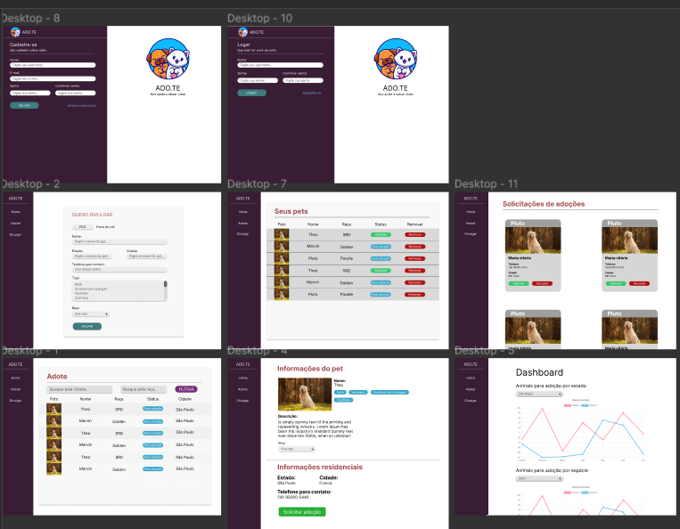

## 🖥️ Projeto
ADO.TE é uma plataforma que visa integrar pessoas que tem pets para colocar pra adoção de pessoas que querem adotar.

Esse projeto foi desenvolvido durante a PyStack Week - o retorno.

## 🛠️ tecnologias
Esse projeto foi desenvolvidos com as seguintes tecnologias

- Python 
- Django
- SQlite3
- HTML
- CSS
- JavaScropt
- Chart.js
- Bootsrap

## 🏷️ Layout
 Você pode visualizar o loyout do projeto através 
 [desse link](https://www.figma.com/file/aE3ZjOTUyI7zJJvocfLpHN/PSW---O-RETORNO?type=design&node-id=0-1&t=jxUKdgk6ugGmQiM6-0).
 É necessário ter uma conta no [Figma](https://www.figma.com)

## :woman_technologist: O Desenvolvedor 

Adnilson ikawa da silva

Contato:
adeikawa@hotmail.com